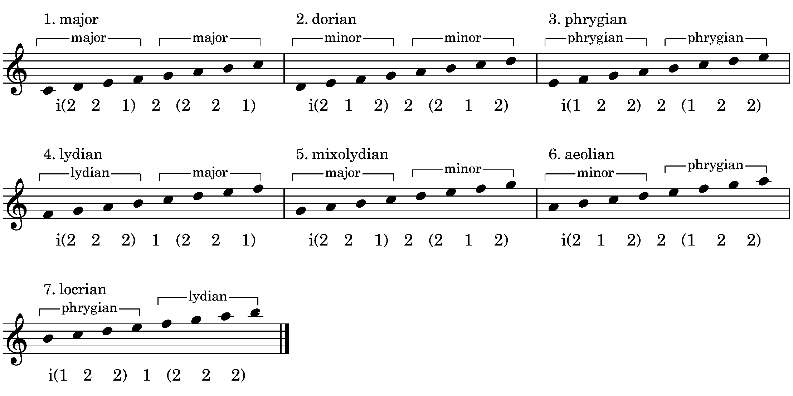

There are a host of skills required for effective improvising on the guitar, let's begin by considering two of them, concerning scales: 1) the ability to play long scale lines, extending if need be from the top of the instrument to the bottom, and vice-versa; 2) the ability to arbitrarily change from one scale to another, regardless of where you are in the scale. I have heard Barry Harris emphasize both of these skills, and they have also been key tenets of my studies with Mark Sherman.

Why, then, are both of these skills so difficult to attain on the guitar in particular?

I think that part of the blame lies in the over-emphasis on practicing scales strictly in position. While it is true that scale practice in position leads to good muscle memory and fast execution, it places an obvious limit on range, with a typical position providing at best just over two octaves. Position playing also tends to "chunk" a scale into an entire position, making it difficult to change to any arbitrary scale at any point.

In my own practice, I have come to believe that working on scales in four-note groups, or tetrachords, helps to solve both problems. In this article, I will focus on the tetrachords themselves, how they are constructed, and how they are combined to create scales. I will leave the details of how to effectively practice them for other articles and lessons. Conversely, when I reference scalar tetrachords in other materials, I refer anyone who needs a refresher back to this article.

## Constructing scalar tetrachords: intervallic constraints

What makes a tetrachord scale-like? The two key properties of scales are that they are constructed of "smaller" intervals, and they continue in one direction. Let's dive in and start constructing tetrachords by listing some constraints on which "smaller" intervals may be used. Let's define the smaller intervals as being intervals of 1, 2, or 3 semitones. But for our first group of tetrachords, we will just consider intervals of 1 or 2 semitones.

**Constraint 1:** An interval of 1 is allowed, but may not be repeated and must be followed by a different interval; the interval subset i(1-1) is not allowed.

**Constraint 2:** An interval of 2 is allowed, and may also be repeated.

With only these two constraints in play, we can generate a group of five tetrachords which combine to form many of the most important scales in jazz: the diatonic modes, melodic minor modes, diminished scale and wholetone scale. For each tetrachord, I will show the ordered interval set used to construct the tetrachord, an ordered pitch set of the tetrachord using integer notation, and a name for the tetrachord.

| Tetrachord name | Interval set | Pitch set | Symmetry |
|---|---|---|---|
| diminished | i(1-2-1) | p(0,1,3,4) | self |
| phrygian | i(1-2-2) |  p(0,1,3,5) |  mirror of major |
| minor |  i(2-1-2) |  p(0,2,3,5) |  self |
| major |  i(2-2-1) |  p(0,2,4,5) | mirror of phrygian |
| lydian |  i(2-2-2) |  p(0,2,4,6) |  self |

<figure><figcaption></figcaption>Figure 1 tetrachords on number lines</figure>

Now let's revisit our first constraint about intervals of 1. If we now allow immediate repetitions of interval 1, we add three more tetrachords. This brings our total to eight tetrachords, which is the total number of tetrachords one can construct out of the intervals 1 and 2.

**Constraint 1a:** An interval of 1 is allowed, and also may now be repeated.

| Tetrachord name | Interval set | Pitch set | Symmetry |
|---|---|---|---|
| chromatic | i(1-1-1) | p(0,1,2,3) | self |
|   | i(1-1-2) | p(0,1,2,4) | mirror of "Straight, No Chaser" |
| "Straight, No Chaser" | i(2-1-1) | p(0,2,3,4) |  |

With these three added tetrachords, we can now also construct the chromatic scale, as well as the family of bebop scales. Together with the scales we added previously, this now covers almost all of the most widely-used scales in jazz. However, we still have not been able to construct the pentatonic scales, or the harmonic minor and harmonic major scales. In order to add those scales, we will need additional tetrachords that include the interval of 3 semitones, so let's address that now, with a new constraint.

**Constraint 3:** An interval of 3 is allowed, but may only be used once in the tetrachord.

| Tetrachord name | Interval set | Pitch set | Symmetry |
|---|---|---|---|
| major b2 | i(1-3-1) | p(0,1,4,5) | self |
|   | i(1-2-3) | p(0,1,3,6) |  |
| all-interval | i(1-3-2) | p(0,1,4,6) |  |
| minor #4 | i(2-1-3) | p(0,2,3,6) |  |
|   | i(2-3-1) | p(0,2,5,6) |  |
|   | i(3-1-2) | p(0,3,4,6) |  |
| blues | i(3-2-1) | p(0,3,5,6) |  |
| major pentatonic | i(2-2-3) | p(0,2,4,7) | mirror of minor pentatonic |
| "I've Got Rhythm" | i(2-3-2) | p(0,2,5,7) | self |
| minor pentatonic | i(3-2-2) | p(0,3,5,7) | mirror of major pentatonic |

## Constructing scales with the tetrachords

Until now, we have been thinking of tetrachords as entities in themselves, so now let's look at how the various tetrachords combine to form scales and modes.

### Diatonic modes

| Mode | Lower tetrachord | Upper tetrachord | Symmetry |
|---|---|---|---|
| 1. major | major | major | mirror of phrygian |
| 2. dorian | minor | minor | self |
| 3. phrygian | phrygian | phrygian | mirror of major |
| 4. lydian | lydian | major | mirror of locrian |
| 5. mixolydian | major | minor | mirror of aeloian |
| 6. aeolian | minor | phrygian | mirror of mixolydian |
| 7. locrian | phrygian | lydian | mirror of lydian |

<figure><figcaption></figcaption>Figure 1 diatonic modes</figure>

### Melodic minor modes

| Mode | Lower tetrachord | Upper tetrachord | Symmetry |
|---|---|---|---|
| 1. melodic minor | minor | major | mirror of dorian b2 |
| 2. dorian b2 | phrygian | minor | mirror of melodic minor |
| 3. lydian #5 | lydian | diminished | mirror of altered |
| 4. lydian dominant | lydian | minor | mirror of locrian #2 |
| 5. mixolydian b6 | major | phrygian | self |
| 6. locrian #2 | minor | lydian | mirror of lydian dominant |
| 7. altered | diminished | lydian | mirror of lydian #5 |

<figure><figcaption></figcaption>Figure 2 Melodic minor modes</figure>

### The diminished scale

The diminished scale has only two modes. Some people in jazz pedagogy like to call the two modes the "half-whole" and the "whole-half," and some go even further and call these two separate scales to be used on different chords, e.g., use the "half-whole" on a dominant 7th chord, the the "whole-half" on a diminished 7th chord. As you may have guessed, I do not care for that way of thinking, because it obscures the relationship of the dominant and diminished 7th chords, and also makes the diminished scale seem far less interesting than it is--which is a topic that I will explore in depth elsewhere on this site.

| Mode | Lower tetrachord | Upper tetrachord | Symmetry |
|---|---|---|---|
| mode 1 | diminished | diminished | self |
| mode 2 | minor | minor | self |

<figure><figcaption></figcaption>Figure 3 diminished modes</figure>

Because the diminished scale is an octatonic scale, two tetrachords align perfectly with one octave of the scale. That means that the next octave will repeat exactly the previous two tetrachords. But, as we see, each mode consists of two repetitions of the same tetrachord, so the next octave will repeat the same tetrachord, and so on until you reach the top of your instrument. So, for example, three octaves of mode 1 would proceed as diminished - diminished - diminished - diminished - diminished - diminished. And likewise, three octaves of mode 2 would proceed as minor - minor - minor - minor - minor - minor. This is so conceptually simple, and physically simple, that it makes long diminished scale runs actually quite easy to play, and yet it is not usually taught this way.  

### The wholetone scale

Since the wholetone scale is a hexatonic scale, two 

| Mode | Lower tetrachord | Upper tetrachord | Symmetry |
|---|---|---|---|
| mode 1 | lydian | lydian | self |

<figure><figcaption></figcaption>Figure 4 wholetone modes</figure>

### Harmonic minor modes

| Mode | Lower tetrachord | Upper tetrachord | Symmetry |
|---|---|---|---|
| 1. harmonic minor | minor | major b2 | mode 5 |
| 2. | phrygian | lydian #2 | mode 4 |
| 3. | major | diminished | mode 3 |
| 4. dorian #4 | minor #4 | minor | mode 2 |
| 5. phrygian dominant | major b2 | phrygian | mode 1 |
| 6. | lydian #2 | major | mode 7 |
| 7. | diminished | minor #4 | mode 6 |

<figure><figcaption></figcaption>Figure 5 harmonic minor modes</figure>

### Harmonic major modes

| Mode | Lower tetrachord | Upper tetrachord | Symmetry |
|---|---|---|---|
| 1. harmonic major | major | major b2 | mode 5 |
| 2. dorian b5 | minor | lydian #2 | mode 4 |
| 3. phrygian b4 | diminished | phrygian | mode 3 |
| 4. melodic minor #4 | minor #4 | major | mode 2 |
| 5. mixolydian b2 | major b2 | minor | mode 1 |
| 6. | lydian #2 | diminished | mode 7 |
| 7. | phrygian | minor #4 | mode 6 |

<figure><figcaption></figcaption>Figure 6 harmonic major modes</figure>

### Pentatonic scale modes

### The chromatic scale

Because the chromatic scale is a dodecaphonic scale, it takes three tetrachords rather than two to exhaust all the notes in the scale. And, like the wholetone scale, it has a single scalar generator, the interval 1, which means it has only one mode. 

| Mode | Lower tetrachord | Middle tetrachord | Upper tetrachord | Symmetry |
|---|---|---|---|---|
| mode 1 | chromatic | chromatic | chromatic | self |

### The bebop scale
