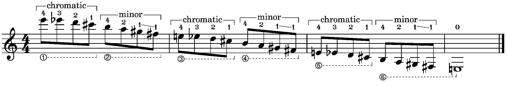
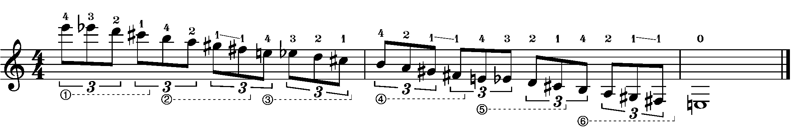
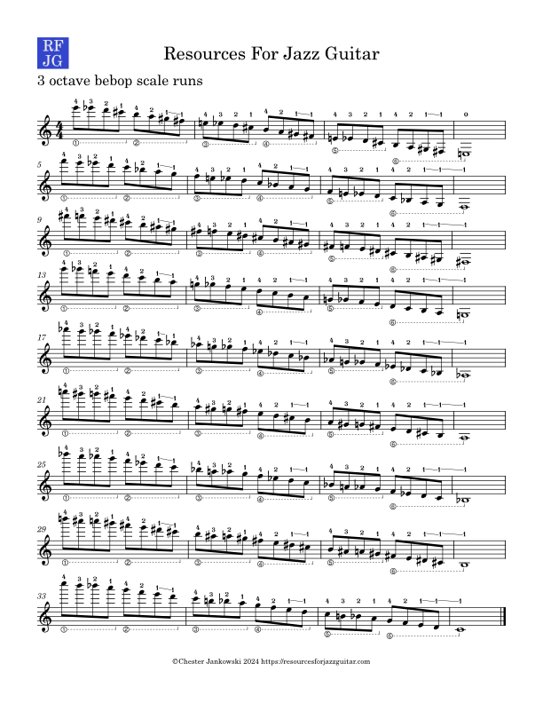

In my forthcoming article on scalar tetrachords, I go into some detail on the theory and construction of tetrachords. In this very brief article, I give one practical example of how to leverage tetrachords to construct a very useful fingering for three-octave bebop scale runs.

Please take a look at Example 1. As you can see, a root position descending bebop scale uses a chromatic tetrachord, followed by a minor tetrachord. Since the bebop scale[^1] is an 8-note[^2] scale, two tetrachords align perfectly with one octave of the scale; the next octave will also be a chromatic tetrachord, followed by a minor tetrachord, and so forth. (Or, in other words, there is no "procession of the tetrachords" as I explain in my article.) 

<figure><figcaption></figcaption>Ex. 1</figure>

Take note of the fingering pattern. We are playing each tetrachord on one string, or, what sometimes is termed a 4-notes-per-string pattern. For the descending minor tetrachord, I am indicating a slide on the first finger; these can also be played with four fingers, especially when in higher positions.

In the practice materials, I am repeating each scale up a semitone, until I reach the top of the instrument, which in the case of my ES-175, is a high C. In the practice materials, I have included the descending scales, which are the most characteristic for jazz, but the ascending scales should also be practiced. In that case, for the ascending minor tetrachord, you can use a shift on the fourth finger.

It is also a good idea to practice these runs with other rhythmic vales. Triplets are especially important, because the tetrachords no longer line up with the beat, making the exercise more difficult, see Example 2.

<figure><figcaption></figcaption>Ex. 2</figure>

## Practice materials

A PDF of the descending scales is included below. Happy practicing!

*Notes*

[^1]:While it's true that Barry Harris disliked the term bebop scale, it is used commonly enough that it's worth keeping, especially for this usage with a single added note. I also note in my article on [generated collections](/generated-collections) that the bebop scale is a superset of the diatonic collection, using the same generator.
[^2]:We could say that it is an octatonic scale but that term is strongly connected to the diminished scale.