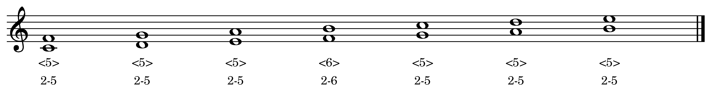
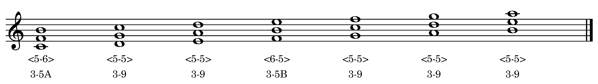
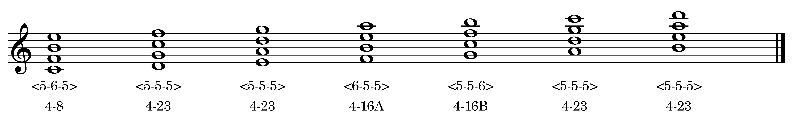
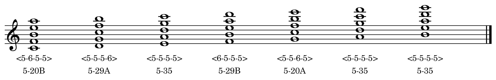
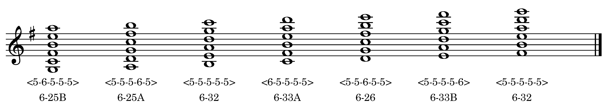

It is well understood that quartal harmony is a useful topic area for jazz guitar. However, the way the subject is usually taught does little to shed light on why these chords are, by necessity, structured the way they are.

## Diatonic set theory

[Pitch class set theory](https://en.wikipedia.org/wiki/Set_theory_(music)) is a branch of music theory that originated in the late 1950s with the composer and theorist Milton Babbit, followed by writers including Donald Martino, Allen Forte, George Perle, David Lewin, Robert Morris, John Rahn, and a host of others. Pc set theory uses concepts and tools from mathematics—including [set theory](https://mathworld.wolfram.com/SetTheory.html), [group theory](https://mathworld.wolfram.com/GroupTheory.html), and [combinatorics](https://mathworld.wolfram.com/Combinatorics.html)—to describe relationships and transformations between groups of [pitch classes](https://en.wikipedia.org/wiki/Pitch_class). By the 1970s, pc set theory was the dominant approach to analyzing post-tonal music composed after about 1910. 

Starting in the late 1970s, a group of theorists began using some of the techniques of pc set theory to examine tonal music, and specifically, the properties of the diatonic collection itself. This branch of music theory has come to be known as [diatonic set theory](https://en.wikipedia.org/wiki/Diatonic_set_theory). It’s important to note that diatonic set theory is not meant to replace the theory of tonal music that was developed in the 18th and 19th centuries, but to 
## Cardinality equals variety

## The diatonic collection as a generated set

## Diatonic quartal dyads

<figure><figcaption>Ex. 1 Quartal dyads</figcaption></figure>

## Diatonic quartal trichords

<figure><figcaption>Ex. 2 Quartal trichords</figcaption></figure>

## Diatonic quartal tetrachords

<figure><figcaption>Ex. 3 Quartal tetrachords</figcaption></figure>

## Diatonic quartal pentachords

<figure><figcaption>Ex. 4 Quartal pentachords</figcaption></figure>

## Diatonic quartal hexachords

<figure><figcaption>Ex. 5 Quartal hexachords</figcaption></figure>

## Diatonic quartal hexachords and scale fingerings

## Practice materials