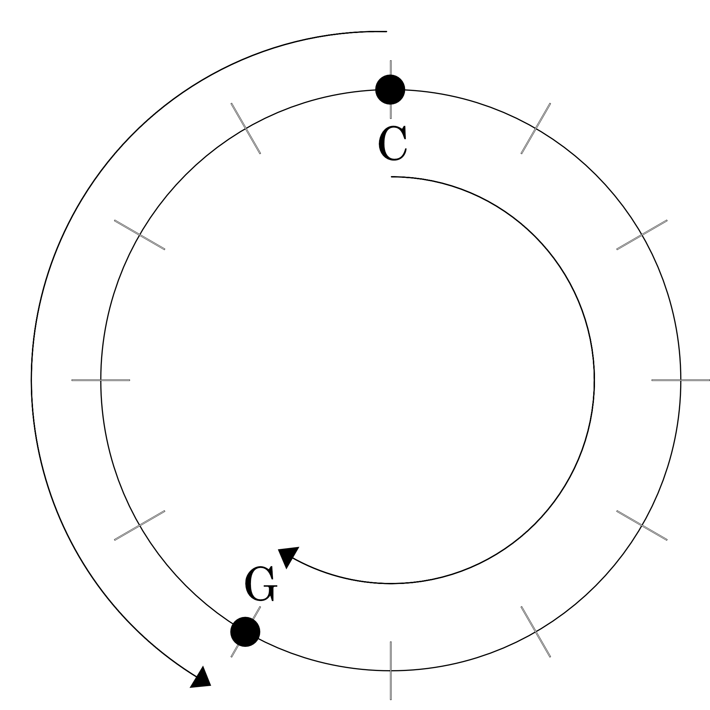

## Interval Class Vectors

Let's begin with some review. A pitch class represents a pitch without regard for octave or enharmonic spelling, so for example, we can write C1, B#2, and Dbb3 all as the single pitch class {0}. We could write out the complete diatonic collection "In C" as follows: {0, 2, 4, 5, 7, 9, 11}.

Similarly, an interval class is the smallest distance, in semitones, between two pitch classes. Let's take the interval between C1 and G1. In pc terms, that would be {0, 7}. So clearly, the distance in semitones is 7-0=7, right? Yes, but there is an even smaller distance if instead of climbing down from 7 to 0, you climb up to 12, which is also equivalent to 0. So the smallest distance is 12-7=5. The easiest way to visualize this is with a circle diagram.

<figure><figcaption>Ex. 1</figcaption></figure>

In the circle diagram Ex. 1, we have C at 12 o'clock and G at 7 o'clock. Counting clockwise, it is 7 steps from C to G, but counting counter-clockwise, it is only 5 steps from C to G. Therefore, the interval class for C to G is {5}.